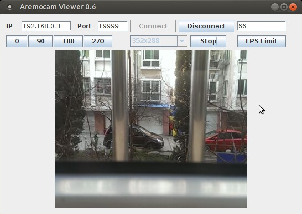

# CamView - Java viewer for [another remote camera](https://github.com/aaronps/aremocam)

[aremocam](https://github.com/aaronps/aremocam) viewer for computers. This uses a custom protocol to connect and transfer the images.

